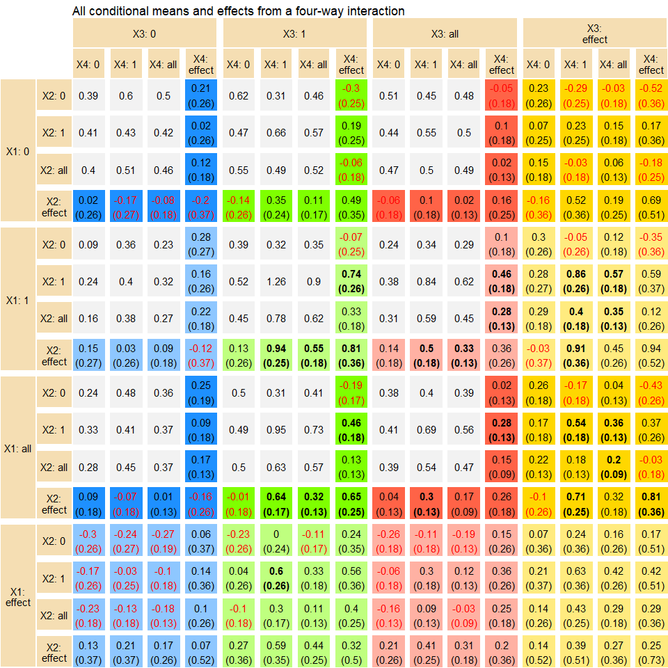

    Warning: package 'ggplot2' was built under R version 4.2.3

# Rinteract

[](https://github.com/jonfoong/Rinteract/actions/workflows/R-CMD-check.yaml)[](https://codecov.io/github/jonfoong/Rinteract)[](https://CRAN.R-project.org/package=Rinteract)[](https://cran.r-project.org/web/licenses/GPL-3)[](https://github.com/jonfoong/Rinteract)

Rinteract is a small package that makes it easy to output all
conditional effects in models with interaction terms instead of
computing hypothesis tests manually.

## Installation

``` r
devtools::install_github("jonfoong/Rinteract")
```

## Overview

Interaction terms are widely used in regression models to uncover
underlying heterogeneity. Despite its ubiquity, the interpretation of
interaction models is often confusing at best and inaccurate at worst.
In addition, studies typically only report estimates from a model output
and neglect their conditional effects. As noted in Brambor et al (2006):

> …the typical results table often conveys very little information of
> interest because the analyst is not concerned with model parameters
> per se; he or she is primarily interested in the marginal effect of X
> on Y for substantively meaningful values of the conditioning variable
> Z. While it is often possible to calculate the marginal effect of X
> for any value of Z from the typical results table using a little
> algebra, the problem is that it is not possible to do the same for the
> standard errors.

Demeaning variables before estimation partly resolves this issue.
However, we may also be interested in effect sizes for specific
conditions beyond just the mean. Consider a hypothetical drug treatment
for which we are also interested in heterogeneity across genders. We
estimate a simple model:

$Y = \alpha + \beta Treat + \gamma Female + \delta Treat Female+\epsilon$

The estimated parameter $\hat{\delta}$ gives us the difference in
treatment effect between male and female patients. However, we are also
interested in the treatment effect conditioning on being a female
patient, which is given by $\hat{\beta} + \hat{\delta}$. While this
simple arithmetic can be performed by looking at a regression table,
uncertainty estimates are not so easily obtained.

`Rinteract` resolves this by computing all conditional effects in a
model with interactions. It accepts a model object as input and relies
on `multcomp` to perform hypothesis testing on all conditions of
interest (when a variable is at 0, 1, or the mean). It is also capable
of graphing these effects using tabular ggplots.

## Usage

``` r
mod <- lm(Y~X1*X2*X3*X4, toydata)
dat <- int_conditions(mod, toydata)
dat |> 
  head() |>
  kable(digits = 3)
```

<table>
 <thead>
  <tr>
   <th style="text-align:left;"> X1 </th>
   <th style="text-align:left;"> X2 </th>
   <th style="text-align:left;"> X3 </th>
   <th style="text-align:left;"> X4 </th>
   <th style="text-align:right;"> estimate </th>
   <th style="text-align:right;"> std.error </th>
   <th style="text-align:right;"> p.value </th>
   <th style="text-align:left;"> value </th>
  </tr>
 </thead>
<tbody>
  <tr>
   <td style="text-align:left;"> effect </td>
   <td style="text-align:left;"> 0 </td>
   <td style="text-align:left;"> 0 </td>
   <td style="text-align:left;"> 0 </td>
   <td style="text-align:right;"> -0.301 </td>
   <td style="text-align:right;"> 0.256 </td>
   <td style="text-align:right;"> 0.241 </td>
   <td style="text-align:left;"> Causal effect </td>
  </tr>
  <tr>
   <td style="text-align:left;"> effect </td>
   <td style="text-align:left;"> all </td>
   <td style="text-align:left;"> 0 </td>
   <td style="text-align:left;"> 0 </td>
   <td style="text-align:right;"> -0.235 </td>
   <td style="text-align:right;"> 0.184 </td>
   <td style="text-align:right;"> 0.202 </td>
   <td style="text-align:left;"> Causal effect </td>
  </tr>
  <tr>
   <td style="text-align:left;"> effect </td>
   <td style="text-align:left;"> 1 </td>
   <td style="text-align:left;"> 0 </td>
   <td style="text-align:left;"> 0 </td>
   <td style="text-align:right;"> -0.168 </td>
   <td style="text-align:right;"> 0.264 </td>
   <td style="text-align:right;"> 0.526 </td>
   <td style="text-align:left;"> Causal effect </td>
  </tr>
  <tr>
   <td style="text-align:left;"> effect </td>
   <td style="text-align:left;"> 0 </td>
   <td style="text-align:left;"> all </td>
   <td style="text-align:left;"> 0 </td>
   <td style="text-align:right;"> -0.265 </td>
   <td style="text-align:right;"> 0.181 </td>
   <td style="text-align:right;"> 0.145 </td>
   <td style="text-align:left;"> Causal effect </td>
  </tr>
  <tr>
   <td style="text-align:left;"> effect </td>
   <td style="text-align:left;"> 0 </td>
   <td style="text-align:left;"> 1 </td>
   <td style="text-align:left;"> 0 </td>
   <td style="text-align:right;"> -0.231 </td>
   <td style="text-align:right;"> 0.256 </td>
   <td style="text-align:right;"> 0.367 </td>
   <td style="text-align:left;"> Causal effect </td>
  </tr>
  <tr>
   <td style="text-align:left;"> effect </td>
   <td style="text-align:left;"> 0 </td>
   <td style="text-align:left;"> 0 </td>
   <td style="text-align:left;"> all </td>
   <td style="text-align:right;"> -0.268 </td>
   <td style="text-align:right;"> 0.188 </td>
   <td style="text-align:right;"> 0.154 </td>
   <td style="text-align:left;"> Causal effect </td>
  </tr>
</tbody>
</table>

We can then graph the result. `int_graph` returns a ggplot object that
can be further manipulated.

``` r
int_graph(dat, X1+X2~X3+X4, digits = 2) +
  ggtitle("All conditional means and effects from a four-way interaction")
```



------------------------------------------------------------------------

Note: As of now the package only accepts `lm`, `glm` and `lm_robust`
models. `int_graph` also only takes up to four-way interactions as of
yet; for clarity we do not recommended going higher than this. One way
to visualise five or higher way interactions is to choose up to four
variables to plot, and then keep values for all other variables fixed
before feeding into `int_graph`.
