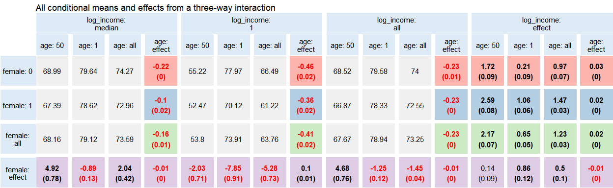

# Rinteract

[](https://github.com/jonfoong/Rinteract/actions/workflows/R-CMD-check.yaml)[](https://codecov.io/github/jonfoong/Rinteract)[](https://CRAN.R-project.org/package=Rinteract)[](https://cran.r-project.org/web/licenses/GPL-3)[](https://github.com/jonfoong/Rinteract)

Rinteract makes it easy to output all conditional effects in models with
interaction terms instead of computing hypothesis tests manually.

## Installation

``` r
devtools::install_github("jonfoong/Rinteract")
```

## Overview

Interaction terms are widely used in regression models to uncover
underlying heterogeneity. Despite its ubiquity, the interpretation of
interaction models is often confusing at best and inaccurate at worst.
In addition, studies typically only report estimates from a model output
and neglect their conditional effects. As noted in Brambor et al (2006):

> …the typical results table often conveys very little information of
> interest because the analyst is not concerned with model parameters
> per se; he or she is primarily interested in the marginal effect of X
> on Y for substantively meaningful values of the conditioning variable
> Z. While it is often possible to calculate the marginal effect of X
> for any value of Z from the typical results table using a little
> algebra, the problem is that it is not possible to do the same for the
> standard errors.

Demeaning variables before estimation partly resolves this issue.
However, we may also be interested in effect sizes for specific
conditions beyond just the mean. Consider a hypothetical drug treatment
for which we are also interested in heterogeneity across genders. We
estimate a simple model:

$$Y = \alpha + \beta * Treat + \gamma * Female + \delta * Treat * Female+\epsilon$$

The estimated parameter $\hat{\delta}$ gives us the difference in
treatment effect between male and female patients. However, we are also
interested in the treatment effect conditioning on being a female
patient, which is given by $\hat{\beta} + \hat{\delta}$. While this
simple arithmetic can be performed by looking at a regression table,
uncertainty estimates are not so easily obtained.

`Rinteract` facilitates this by computing all conditional effects in a
model with interactions. It accepts a model object as input and relies
on `multcomp` to perform hypothesis testing on all conditions of
interest. It also provides functionality for graphing these effects via
tabular ggplots that can be further manipulated.

## Usage

We use data from the Rand Health Insurance Experiment from the
`sampleSelection` package to illustrate an example. By default,
int_conditions takes a fitted model and returns all effects in the 0, 1,
and mean condition for all variables.

``` r
data("RandHIE")

mod <- fixest::feols(xghindx~female*black*linc*xage|year, RandHIE)

dat <- int_conditions(mod, RandHIE,
                      fixef = list(year = factor(unique(RandHIE$year))),
                      .names = c(female = "female",
                                 black = "black",
                                 log_income = "linc",
                                 age = "xage"))

dat |> 
  head() |>
  kable(digits = 3)
```

<table>
 <thead>
  <tr>
   <th style="text-align:left;"> female </th>
   <th style="text-align:left;"> black </th>
   <th style="text-align:left;"> log_income </th>
   <th style="text-align:left;"> age </th>
   <th style="text-align:right;"> estimate </th>
   <th style="text-align:right;"> std.error </th>
   <th style="text-align:right;"> p.value </th>
   <th style="text-align:left;"> value </th>
  </tr>
 </thead>
<tbody>
  <tr>
   <td style="text-align:left;"> effect </td>
   <td style="text-align:left;"> 0 </td>
   <td style="text-align:left;"> 0 </td>
   <td style="text-align:left;"> 0 </td>
   <td style="text-align:right;"> -7.162 </td>
   <td style="text-align:right;"> 0.397 </td>
   <td style="text-align:right;"> 0 </td>
   <td style="text-align:left;"> Causal effect </td>
  </tr>
  <tr>
   <td style="text-align:left;"> effect </td>
   <td style="text-align:left;"> all </td>
   <td style="text-align:left;"> 0 </td>
   <td style="text-align:left;"> 0 </td>
   <td style="text-align:right;"> -7.528 </td>
   <td style="text-align:right;"> 0.422 </td>
   <td style="text-align:right;"> 0 </td>
   <td style="text-align:left;"> Causal effect </td>
  </tr>
  <tr>
   <td style="text-align:left;"> effect </td>
   <td style="text-align:left;"> 1 </td>
   <td style="text-align:left;"> 0 </td>
   <td style="text-align:left;"> 0 </td>
   <td style="text-align:right;"> -9.176 </td>
   <td style="text-align:right;"> 1.070 </td>
   <td style="text-align:right;"> 0 </td>
   <td style="text-align:left;"> Causal effect </td>
  </tr>
  <tr>
   <td style="text-align:left;"> effect </td>
   <td style="text-align:left;"> 0 </td>
   <td style="text-align:left;"> all </td>
   <td style="text-align:left;"> 0 </td>
   <td style="text-align:right;"> -0.893 </td>
   <td style="text-align:right;"> 0.140 </td>
   <td style="text-align:right;"> 0 </td>
   <td style="text-align:left;"> Causal effect </td>
  </tr>
  <tr>
   <td style="text-align:left;"> effect </td>
   <td style="text-align:left;"> 0 </td>
   <td style="text-align:left;"> 1 </td>
   <td style="text-align:left;"> 0 </td>
   <td style="text-align:right;"> -6.442 </td>
   <td style="text-align:right;"> 0.367 </td>
   <td style="text-align:right;"> 0 </td>
   <td style="text-align:left;"> Causal effect </td>
  </tr>
  <tr>
   <td style="text-align:left;"> effect </td>
   <td style="text-align:left;"> 0 </td>
   <td style="text-align:left;"> 0 </td>
   <td style="text-align:left;"> all </td>
   <td style="text-align:right;"> -6.980 </td>
   <td style="text-align:right;"> 0.920 </td>
   <td style="text-align:right;"> 0 </td>
   <td style="text-align:left;"> Causal effect </td>
  </tr>
</tbody>
</table>

From the first row we see that the effect of being a non-black woman,
condition on income and age at zero, is -7.16. Obviously these
conditions are of little analytical value. While `int_conditions` also
returns mean conditions, we can also specify specific values for our
variables to take.

``` r

median_inc <- round(median(RandHIE$linc), 3)

dat <- int_conditions(mod, RandHIE,
                      zero_con = c(xage = 50,
                                   linc = median_inc),
                      fixef = list(year = factor(unique(RandHIE$year))),
                      .names = c(female = "female",
                                 black = "black",
                                 log_income = "linc",
                                 age = "xage"))
dat |> 
  head() |>
  kable(digits = 3)
```

<table>
 <thead>
  <tr>
   <th style="text-align:left;"> female </th>
   <th style="text-align:left;"> black </th>
   <th style="text-align:left;"> log_income </th>
   <th style="text-align:left;"> age </th>
   <th style="text-align:right;"> estimate </th>
   <th style="text-align:right;"> std.error </th>
   <th style="text-align:right;"> p.value </th>
   <th style="text-align:left;"> value </th>
  </tr>
 </thead>
<tbody>
  <tr>
   <td style="text-align:left;"> effect </td>
   <td style="text-align:left;"> 0 </td>
   <td style="text-align:left;"> 8.984 </td>
   <td style="text-align:left;"> 50 </td>
   <td style="text-align:right;"> -0.340 </td>
   <td style="text-align:right;"> 1.848 </td>
   <td style="text-align:right;"> 0.854 </td>
   <td style="text-align:left;"> Causal effect </td>
  </tr>
  <tr>
   <td style="text-align:left;"> effect </td>
   <td style="text-align:left;"> all </td>
   <td style="text-align:left;"> 8.984 </td>
   <td style="text-align:left;"> 50 </td>
   <td style="text-align:right;"> -0.705 </td>
   <td style="text-align:right;"> 2.003 </td>
   <td style="text-align:right;"> 0.725 </td>
   <td style="text-align:left;"> Causal effect </td>
  </tr>
  <tr>
   <td style="text-align:left;"> effect </td>
   <td style="text-align:left;"> 1 </td>
   <td style="text-align:left;"> 8.984 </td>
   <td style="text-align:left;"> 50 </td>
   <td style="text-align:right;"> -2.353 </td>
   <td style="text-align:right;"> 2.755 </td>
   <td style="text-align:right;"> 0.393 </td>
   <td style="text-align:left;"> Causal effect </td>
  </tr>
  <tr>
   <td style="text-align:left;"> effect </td>
   <td style="text-align:left;"> 0 </td>
   <td style="text-align:left;"> all </td>
   <td style="text-align:left;"> 50 </td>
   <td style="text-align:right;"> -0.538 </td>
   <td style="text-align:right;"> 1.846 </td>
   <td style="text-align:right;"> 0.771 </td>
   <td style="text-align:left;"> Causal effect </td>
  </tr>
  <tr>
   <td style="text-align:left;"> effect </td>
   <td style="text-align:left;"> 0 </td>
   <td style="text-align:left;"> 1 </td>
   <td style="text-align:left;"> 50 </td>
   <td style="text-align:right;"> -6.087 </td>
   <td style="text-align:right;"> 1.803 </td>
   <td style="text-align:right;"> 0.001 </td>
   <td style="text-align:left;"> Causal effect </td>
  </tr>
  <tr>
   <td style="text-align:left;"> effect </td>
   <td style="text-align:left;"> 0 </td>
   <td style="text-align:left;"> 8.984 </td>
   <td style="text-align:left;"> all </td>
   <td style="text-align:right;"> -0.512 </td>
   <td style="text-align:right;"> 0.932 </td>
   <td style="text-align:right;"> 0.583 </td>
   <td style="text-align:left;"> Causal effect </td>
  </tr>
</tbody>
</table>

We can also visualize these effects using a graph. `int_graph` returns a
tabular ggplot object that can be further manipulated. Values in bold
correspond to estimates with p-values \<0.05.

``` r
int_graph(dat, black+female~log_income+age, digits = 2) +
  ggtitle("All conditional means and effects from a four-way interaction")
```



------------------------------------------------------------------------

Note: Technically, `int_conditions` will work for all models that are
accepted by `broom::tidy` and `multcomp::glht`.`int_graph` also only
takes up to four-way interactions as of yet; for clarity I do not
recommended going higher than this. One way to visualise five or higher
way interactions is to choose up to four variables to plot, and then
keep values for all other variables fixed before feeding into
`int_graph`.
