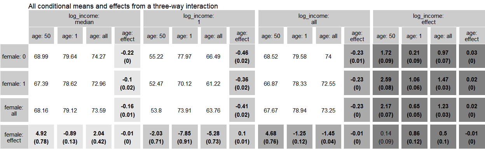

# Rinteract 

[](https://github.com/jonfoong/Rinteract/actions/workflows/R-CMD-check.yaml)[](https://codecov.io/github/jonfoong/Rinteract)[](https://CRAN.R-project.org/package=Rinteract)[](https://cran.r-project.org/web/licenses/GPL-3)[](https://github.com/jonfoong/Rinteract)

Rinteract makes it easy to output all conditional effects in models with
interaction terms instead of computing hypothesis tests manually.

## Installation

``` r
devtools::install_github("jonfoong/Rinteract")
```

## Overview

`Rinteract` aids interpretation of interaction effects by computing all conditional effects in a
model with interactions (see Brambor et al (2006)). It accepts a model object as input and relies
on `multcomp` to perform hypothesis testing on all conditions of
interest. It also provides functionality for graphing these effects via
tabular ggplots that can be further manipulated.

## Usage

We use data from the Rand Health Insurance Experiment from the
`sampleSelection` package to illustrate an example. By default,
`int_conditions` takes a fitted model and returns all effects and model
predictions in the 0, 1, and mean condition for all variables.

``` r
data("RandHIE")

mod <- fixest::feols(xghindx~female*linc*xage|year, RandHIE)

dat <- int_conditions(mod, RandHIE,
                      fixef = list(year = factor(unique(RandHIE$year))),
                      .names = c(female = "female",
                                 log_income = "linc",
                                 age = "xage"))

dat |> 
  head(3) |>
  rbind(dat |> tail(3)) |>
  kable(digits = 3)
```

|     | female | log_income | age | estimate | std.error | p.value | value         |
|:----|:-------|:-----------|:----|---------:|----------:|--------:|:--------------|
| 1   | effect | 0          | 0   |   -8.819 |     1.034 |       0 | Causal effect |
| 2   | effect | all        | 0   |   -1.245 |     0.127 |       0 | Causal effect |
| 3   | effect | 1          | 0   |   -7.950 |     0.917 |       0 | Causal effect |
| 62  | 0      | all        | all |   74.000 |        NA |      NA | Level         |
| 63  | 1      | all        | all |   72.551 |        NA |      NA | Level         |
| 64  | all    | all        | all |   73.251 |        NA |      NA | Level         |

While `int_conditions` also returns mean
conditions, we can also specify values for our variables to take.

``` r

median_inc <- round(median(RandHIE$linc), 3)

dat <- int_conditions(mod, RandHIE,
                      zero_con = c(xage = 50,
                                   linc = median_inc),
                      fixef = list(year = factor(unique(RandHIE$year))),
                      .names = c(female = "female",
                                 log_income = "linc",
                                 age = "xage"))
dat |> 
  head() |>
  kable(digits = 3)
```

| female | log_income | age | estimate | std.error | p.value | value         |
|:-------|:-----------|:----|---------:|----------:|--------:|:--------------|
| effect | 8.984      | 50  |    4.920 |     0.781 |   0.000 | Causal effect |
| effect | all        | 50  |    4.680 |     0.759 |   0.000 | Causal effect |
| effect | 1          | 50  |   -2.025 |     0.708 |   0.004 | Causal effect |
| effect | 8.984      | all |    2.043 |     0.416 |   0.000 | Causal effect |
| effect | 8.984      | 1   |   -0.886 |     0.132 |   0.000 | Causal effect |
| effect | all        | all |   -1.449 |     0.036 |   0.000 | Causal effect |

We can also visualize these effects using a graph. `int_graph` returns a
tabular ggplot object that displays all conditional effects and model
predictions and can be further manipulated. Highlighted cells correspond
to effect estimates and standard errors and the rest are model
predictions. Values in bold correspond to estimates with p-values
\<0.05.

``` r
dat |>
  transform(log_income = ifelse(log_income==median_inc,
         "median", log_income)) |>
  int_graph(female~log_income+age, digits = 2) +
  ggtitle("All conditional means and effects from a three-way interaction")
```


For scientific publications, we can change the color scheme using a few
simple arguments since the output is a ggplot object.

``` r
dat |>
  transform(log_income = ifelse(log_income==median_inc,
         "median", log_income)) |>
  int_graph(female~log_income+age, 
            digits = 2,
            eff_var = "log_income",
            col_level = "white",
            col_label = "gray80",
            col_values = "black") +
  ggtitle("All conditional means and effects from a three-way interaction") +
  scale_fill_grey(start = 0.9, end = 0.5)
```



------------------------------------------------------------------------

Note: Technically, `int_conditions` will work for all models that are
accepted by `multcomp::glht`.`int_graph` also only takes up to four-way
interactions as of yet; for clarity I do not recommended going higher
than this.
